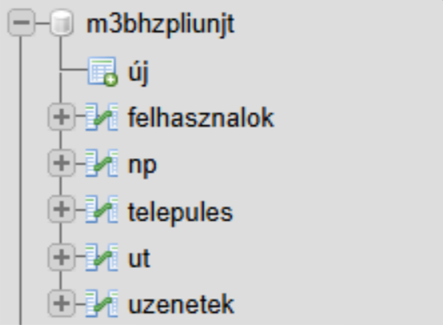
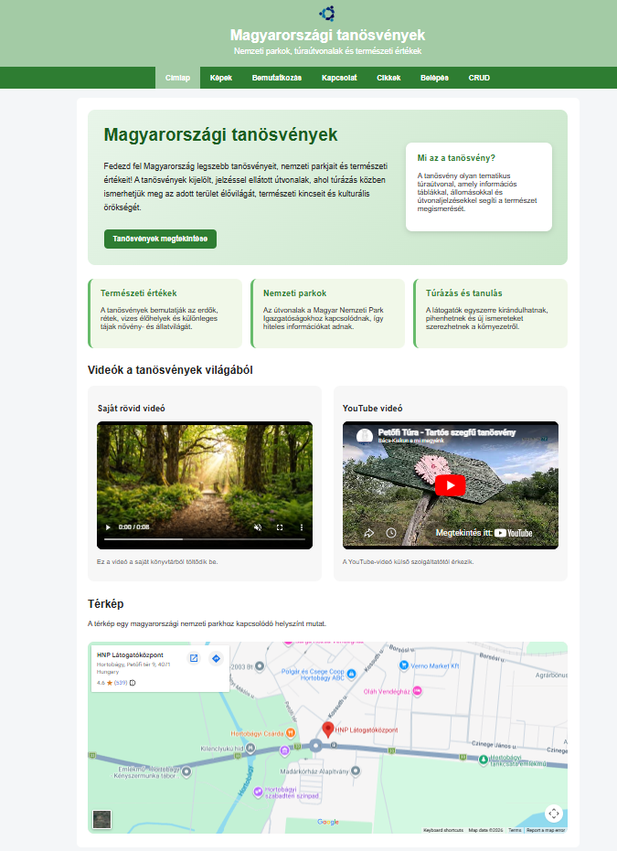
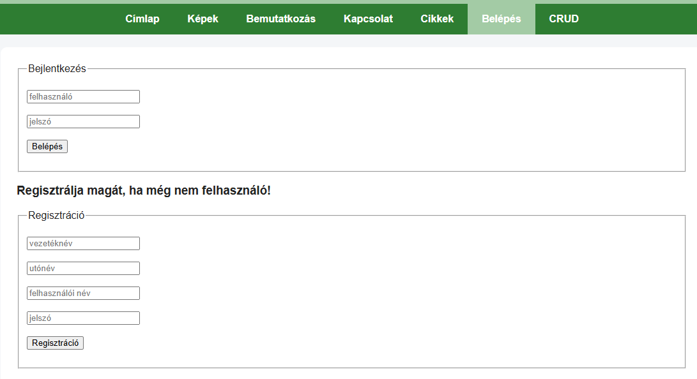
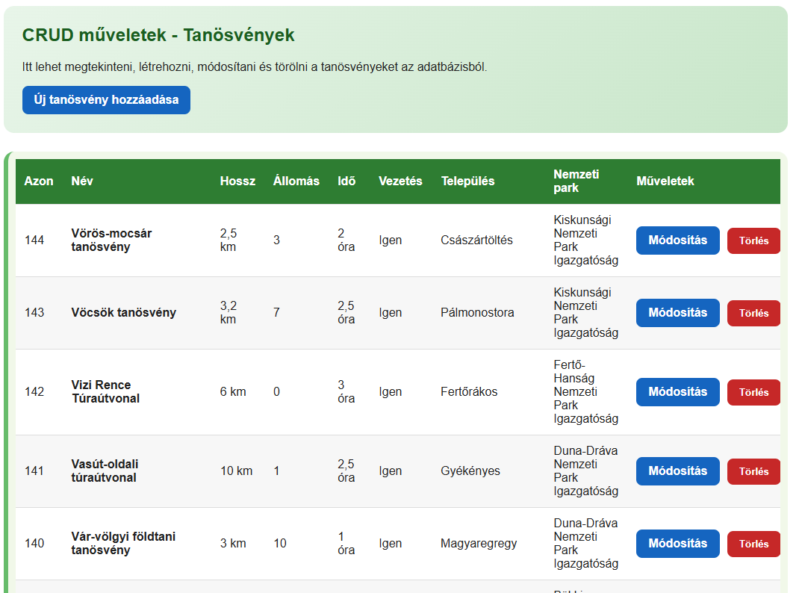
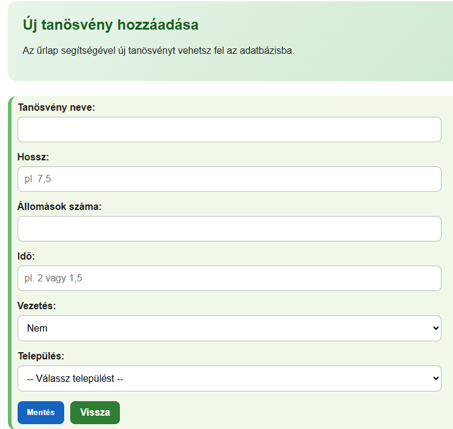
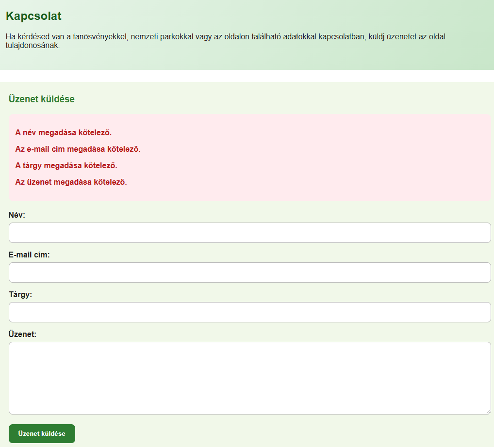
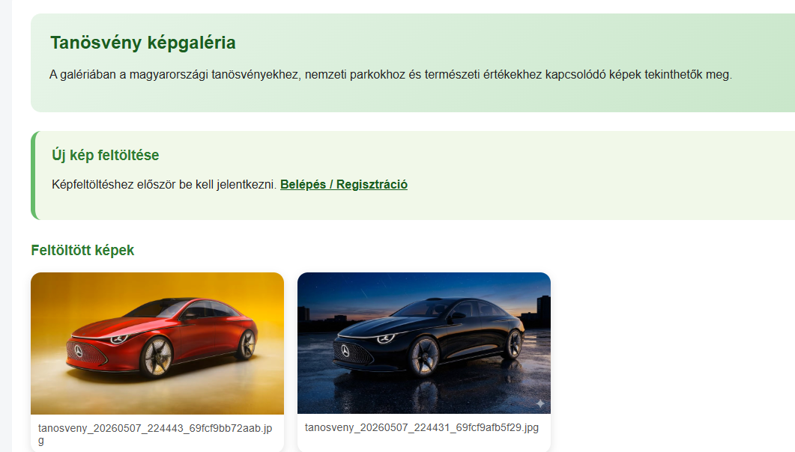
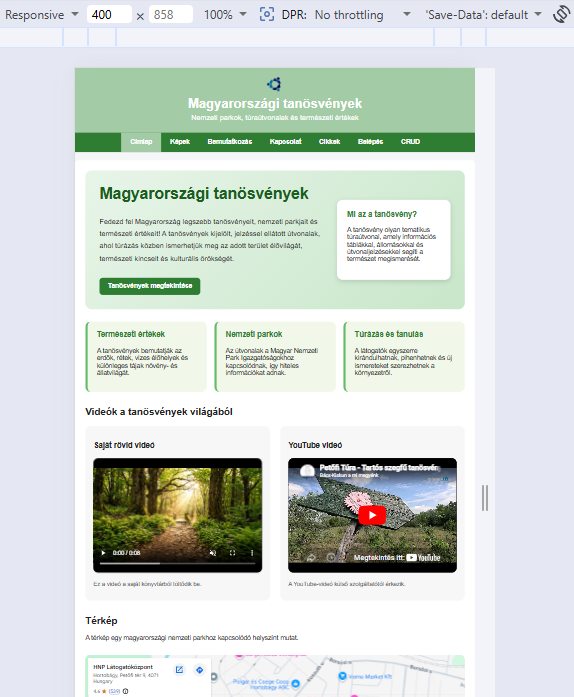

# Magyarországi Tanösvények - Webalkalmazás Dokumentáció

---

## Tartalomjegyzék

1. [Bevezetés](#1-bevezetés)
2. [Az alkalmazás általános bemutatása](#2-az-alkalmazás-általános-bemutatása)
3. [Technikai követelmények és telepítés](#3-technikai-követelmények-és-telepítés)
4. [Adatbázis felépítése](#4-adatbázis-felépítése)
5. [Könyvtárstruktúra](#5-könyvtárstruktúra)
6. [Címlap és navigáció](#6-címlap-és-navigáció)
7. [Felhasználó-kezelés (Bejelentkezés és Regisztráció)](#7-felhasználó-kezelés-bejelentkezés-és-regisztráció)
8. [CRUD műveletek - Tanösvények kezelése](#8-crud-műveletek---tanösvények-kezelése)
9. [Kapcsolati űrlap](#9-kapcsolati-űrlap)
10. [Képgaléria](#10-képgaléria)
11. [Üzenetek megjelenítése](#11-üzenetek-megjelenítése)
12. [Reszponzív design](#12-reszponzív-design)
13. [Biztonsági megoldások](#13-biztonsági-megoldások)
14. [Hozzáférési adatok](#14-hozzáférési-adatok)

---

## 1. Bevezetés

### 1.1 A projekt célja

Ez a dokumentáció a "Magyarországi Tanösvények" webalkalmazás működését mutatja be. Az alkalmazás célja, hogy bemutassa Magyarország tanösvényeit, nemzeti parkjait és természeti értékeit egy interaktív, felhasználóbarát webes felületen keresztül.

### 1.2 A dokumentáció felépítése

A dokumentáció részletesen ismerteti az alkalmazás minden funkcióját, az implementáció helyét a forráskódban, valamint képernyőképekkel illusztrálja a működést.

### 1.3 Készítő adatai

- **Készítette:** Varsás-Guti Anita (LIUNJT), Kulcsár Dániel (M3BHZP)
- **Tantárgy:** Webprogramozás
- **Dátum:** 2026. 06. 09.

---

## 2. Az alkalmazás általános bemutatása

### 2.1 Az alkalmazás funkciói

Az alkalmazás a következő főbb funkciókat valósítja meg:

| Funkció | Leírás |
|---------|--------|
| Címlap | Bemutató oldal videókkal és térképpel |
| Képgaléria | Feltöltött képek megjelenítése |
| Kapcsolat | Üzenetküldési lehetőség |
| Bejelentkezés/Regisztráció | Felhasználó-kezelés |
| CRUD műveletek | Tanösvények kezelése (létrehozás, olvasás, módosítás, törlés) |
| Üzenetek | Beérkezett üzenetek megtekintése |

### 2.2 Felhasználói szerepkörök

1. **Vendég felhasználó**: Címlap, Képek, Bemutatkozás, Kapcsolat, Belépés oldalak elérése
2. **Bejelentkezett felhasználó**: Minden oldal elérése, képfeltöltés, CRUD műveletek, üzenetek megtekintése

### 2.3 Technológiák

- **Backend:** PHP 7/8
- **Adatbázis:** MySQL (PDO)
- **Frontend:** HTML5, CSS3, JavaScript
- **Struktúra:** MVC-szerű sablon rendszer

---

## 3. Technikai követelmények és telepítés

### 3.1 Szerver követelmények

- PHP 7.4 vagy újabb
- MySQL 5.7 vagy újabb
- Apache webszerver mod_rewrite támogatással
- Minimum 50 MB tárhely

### 3.2 Telepítési lépések

1. **Fájlok feltöltése:** Töltse fel a projekt fájljait a webszerver gyökérkönyvtárába
2. **Adatbázis létrehozása:** Futtassa le a `gyakorlat7.sql` fájlt
3. **Konfiguráció:** Módosítsa az `includes/config.inc.php` fájlban az adatbázis kapcsolat adatait

### 3.3 Konfiguráció

A konfigurációs fájl helye: `includes/config.inc.php`

```php
define('DB_HOST', 'localhost');
define('DB_NAME', 'm3bhzpliunjt');
define('DB_USER', 'm3bhzpliunjt');
define('DB_PASS', 'm3bhzpliunjt');
```

---

## 4. Adatbázis felépítése

### 4.1 Adatbázis-kapcsolat megvalósítása

Az adatbázis kapcsolat PDO (PHP Data Objects) használatával történik. A kapcsolat létrehozása az `includes/config.inc.php` fájlban a `getDb()` függvényben valósul meg:

```php
function getDb() {
    static $dbh = null;
    if ($dbh === null) {
        $dbh = new PDO(
            'mysql:host=' . DB_HOST . ';dbname=' . DB_NAME . ';charset=utf8',
            DB_USER,
            DB_PASS,
            array(PDO::ATTR_ERRMODE => PDO::ERRMODE_EXCEPTION)
        );
        $dbh->query('SET NAMES utf8 COLLATE utf8_hungarian_ci');
    }
    return $dbh;
}
```

**Implementáció helye:** `includes/config.inc.php` (9-24. sor)

### 4.2 Táblák szerkezete

#### 4.2.1 felhasznalok tábla

| Oszlop | Típus | Leírás |
|--------|-------|--------|
| id | INT(10) UNSIGNED AUTO_INCREMENT | Elsődleges kulcs |
| csaladi_nev | VARCHAR(45) | Családi név |
| uto_nev | VARCHAR(45) | Utónév |
| bejelentkezes | VARCHAR(12) | Bejelentkezési név |
| jelszo | VARCHAR(40) | SHA1 titkosított jelszó |

#### 4.2.2 ut tábla (tanösvények)

| Oszlop | Típus | Leírás |
|--------|-------|--------|
| azon | INT AUTO_INCREMENT | Elsődleges kulcs |
| nev | VARCHAR | Tanösvény neve |
| hossz | DECIMAL | Hossz km-ben |
| allomas | INT | Állomások száma |
| ido | DECIMAL | Bejárási idő órában |
| vezetes | TINYINT | Vezetés szükséges-e (-1: igen, 0: nem) |
| telepulesid | INT | Idegen kulcs a telepules táblára |

#### 4.2.3 telepules tábla

| Oszlop | Típus | Leírás |
|--------|-------|--------|
| id | INT AUTO_INCREMENT | Elsődleges kulcs |
| nev | VARCHAR | Település neve |
| npid | INT | Idegen kulcs a np táblára |

#### 4.2.4 np tábla (nemzeti parkok)

| Oszlop | Típus | Leírás |
|--------|-------|--------|
| id | INT AUTO_INCREMENT | Elsődleges kulcs |
| nev | VARCHAR | Nemzeti park neve |

#### 4.2.5 uzenetek tábla

| Oszlop | Típus | Leírás |
|--------|-------|--------|
| id | INT AUTO_INCREMENT | Elsődleges kulcs |
| nev | VARCHAR | Küldő neve |
| email | VARCHAR | Küldő e-mail címe |
| targy | VARCHAR | Üzenet tárgya |
| uzenet | TEXT | Üzenet szövege |
| bekuldo_nev | VARCHAR | Bejelentkezett felhasználó neve |
| kuldes_ideje | DATETIME | Küldés időpontja |

### 4.3 Adatbázis képernyőkép

**phpMyAdmin - Táblák és adatok:**


*Képernyőkép: screenshots/08_adatbazis.png*

---

## 5. Könyvtárstruktúra

### 5.1 Gyökérkönyvtár

```
/
├── index.php              # Fő belépési pont
├── gyakorlat7.sql         # Adatbázis séma
├── includes/              # Konfigurációs fájlok
├── logicals/              # PHP üzleti logika
├── templates/             # Sablonfájlok
├── styles/                # CSS stíluslapok
├── scripts/               # JavaScript fájlok
├── images/                # Képek
└── videos/                # Videók
```

### 5.2 Sablonrendszer

Az alkalmazás egy egyszerű, de hatékony sablonrendszert használ:

1. **index.tpl.php**: Fő sablon a fejléc, menü, tartalom és lábléc összeállításához
2. **pages/**: Oldalspecifikus sablonok

**Az oldal betöltés folyamata:**

```php
// index.php
include('./includes/config.inc.php');
$oldal = explode('&', $_SERVER['QUERY_STRING'])[0];
if ($oldal!="") {
    if (isset($oldalak[$oldal]) && file_exists("./templates/pages/{$oldalak[$oldal]['fajl']}.tpl.php")) {
        $keres = $oldalak[$oldal];
    }
    else { 
        $keres = $hiba_oldal;
        header("HTTP/1.0 404 Not Found");
    }
}
else $keres = $oldalak['/'];
include('./templates/index.tpl.php');
```

**Implementáció helye:** `index.php` (1-15. sor)

### 5.3 Oldalak regisztrációja

Az oldalak a `config.inc.php` fájlban vannak definiálva:

```php
$oldalak = array(
    '/' => array('fajl' => 'cimlap', 'szoveg' => 'Címlap', 'menun' => array(1,1)),
    'kepek' => array('fajl' => 'kepek', 'szoveg' => 'Képek', 'menun' => array(1,1)),
    'kapcsolat' => array('fajl' => 'kapcsolat', 'szoveg' => 'Kapcsolat', 'menun' => array(1,1)),
    'belepes' => array('fajl' => 'belepes', 'szoveg' => 'Belépés', 'menun' => array(1,0)),
    'crud' => array('fajl' => 'crud', 'szoveg' => 'CRUD', 'menun' => array(1,1)),
    // ...további oldalak
);
```

A `menun` tömb első eleme a ki nem jelentkezett, a második a bejelentkezett felhasználók számára való megjelenítést szabályozza.

**Implementáció helye:** `includes/config.inc.php` (42-62. sor)

---

## 6. Címlap és navigáció

### 6.1 Fejléc

A fejléc tartalmazza a logót, a weboldal címét és a mottót. Bejelentkezett felhasználó esetén a felhasználó neve is megjelenik.

**Implementáció helye:** `templates/index.tpl.php` (11-17. sor)

```php
<header>
    " alt="<?=$fejlec['kepalt']?>">
    <h1><?= $fejlec['cim'] ?></h1>
    <?php if (isset($fejlec['motto'])) { ?><h2><?= $fejlec['motto'] ?></h2><?php } ?>
    <?php if(isset($_SESSION['login'])) { ?>
        Bejelentkezve: <strong><?= $_SESSION['csn']." ".$_SESSION['un']." (".$_SESSION['login'].")" ?></strong>
    <?php } ?>
</header>
```

### 6.2 Dinamikus menü

A menü dinamikusan épül fel a bejelentkezési állapot alapján:

**Implementáció helye:** `templates/index.tpl.php` (18-30. sor)

```php
<nav id="menu">
    <ul>
        <?php foreach ($oldalak as $url => $oldal) { ?>
            <?php if(! isset($_SESSION['login']) && $oldal['menun'][0] || isset($_SESSION['login']) && $oldal['menun'][1]) { ?>
                <li<?= (($oldal == $keres) ? ' class="active"' : '') ?>>
                    <a href="<?= ($url == '/') ? '.' : $url ?>">
                        <?= $oldal['szoveg'] ?>
                    </a>
                </li>
            <?php } ?>
        <?php } ?>
    </ul>
</nav>
```

### 6.3 Címlap tartalma

A címlap a következő elemeket tartalmazza:

1. **Hero szekció**: Bemutatkozó szöveg és gomb
2. **Információs rács**: Természeti értékek, nemzeti parkok, túrázás leírása
3. **Videó szekció**: Saját videó és YouTube beágyazás
4. **Térkép**: Google Maps beágyazás

**Implementáció helye:** `templates/pages/cimlap.tpl.php` (1-84. sor)

#### 6.3.1 Saját videó beágyazása

```html
<video controls muted>
    <source src="./videos/tanosveny.mp4" type="video/mp4">
    A böngésző nem támogatja a videó lejátszását.
</video>
```

#### 6.3.2 YouTube videó beágyazása

```html
<iframe 
    src="https://www.youtube.com/embed/pJ-f9kmRBUg"
    title="Tanösvény videó"
    allowfullscreen>
</iframe>
```

#### 6.3.3 Google Maps beágyazása

```html
<iframe 
    src="https://www.google.com/maps?q=Hortob%C3%A1gyi%20Nemzeti%20Park%20L%C3%A1togat%C3%B3k%C3%B6zpont&output=embed"
    allowfullscreen
    loading="lazy">
</iframe>
```

### 6.4 Lábléc

A lábléc tartalmazza a copyright információt és a cég nevét.

**Implementáció helye:** `templates/index.tpl.php` (36-40. sor)

### 6.5 Képernyőkép - Címlap

**Címlap teljes nézete (hero szekció, videók, térkép):**


*Képernyőkép: screenshots/01_cimlap.png*

---

## 7. Felhasználó-kezelés (Bejelentkezés és Regisztráció)

### 7.1 Bejelentkezési űrlap

A bejelentkezési űrlap a `belepes.tpl.php` sablonban található.

**Implementáció helye:** `templates/pages/belepes.tpl.php` (1-14. sor)

```html
<form action="belep" method="post">
    <fieldset>
        <legend>Bejelentkezés</legend>
        <input type="text" name="felhasznalo" placeholder="felhasználó" required>
        <input type="password" name="jelszo" placeholder="jelszó" required>
        <input type="submit" name="belepes" value="Belépés">
    </fieldset>
</form>
```

### 7.2 Bejelentkezés feldolgozása

A bejelentkezési logika a `logicals/belep.php` fájlban van:

**Implementáció helye:** `logicals/belep.php` (1-23. sor)

```php
if(isset($_POST['felhasznalo']) && isset($_POST['jelszo'])) {
    try {
        $dbh = getDb();
        
        $sqlSelect = "select id, csaladi_nev, uto_nev from felhasznalok 
                      where bejelentkezes = :bejelentkezes and jelszo = sha1(:jelszo)";
        $sth = $dbh->prepare($sqlSelect);
        $sth->execute(array(':bejelentkezes' => $_POST['felhasznalo'], ':jelszo' => $_POST['jelszo']));
        $row = $sth->fetch(PDO::FETCH_ASSOC);
        
        if($row) {
            $_SESSION['csn'] = $row['csaladi_nev'];
            $_SESSION['un'] = $row['uto_nev'];
            $_SESSION['login'] = $_POST['felhasznalo'];
        }
    }
    catch (PDOException $e) {
        $errormessage = "Hiba: ".$e->getMessage();
    }
}
```

**Biztonsági jellemzők:**
- Prepared statement használata SQL injection ellen
- SHA1 jelszó titkosítás
- Session-alapú autentikáció

### 7.3 Regisztrációs űrlap

A regisztrációs űrlap a bejelentkezési oldal alatt található.

**Implementáció helye:** `templates/pages/belepes.tpl.php` (15-27. sor)

```html
<form action="regisztral" method="post">
    <fieldset>
        <legend>Regisztráció</legend>
        <input type="text" name="vezeteknev" placeholder="vezetéknév" required>
        <input type="text" name="utonev" placeholder="utónév" required>
        <input type="text" name="felhasznalo" placeholder="felhasználói név" required>
        <input type="password" name="jelszo" placeholder="jelszó" required>
        <input type="submit" name="regisztracio" value="Regisztráció">
    </fieldset>
</form>
```

### 7.4 Regisztráció feldolgozása

A regisztrációs logika a `logicals/regisztral.php` fájlban van:

**Implementáció helye:** `logicals/regisztral.php` (1-42. sor)

**Főbb lépések:**
1. Ellenőrzés: létezik-e már a felhasználónév
2. Ha nem létezik: új rekord beszúrása az adatbázisba
3. Visszajelzés a felhasználónak

```php
// Létezik-e már a felhasználónév?
$sqlSelect = "select id from felhasznalok where bejelentkezes = :bejelentkezes";
$sth = $dbh->prepare($sqlSelect);
$sth->execute(array(':bejelentkezes' => $_POST['felhasznalo']));

if($row = $sth->fetch(PDO::FETCH_ASSOC)) {
    $uzenet = "A felhasználói név már foglalt!";
    $ujra = "true";
}
else {
    // Regisztrálás
    $sqlInsert = "insert into felhasznalok(id, csaladi_nev, uto_nev, bejelentkezes, jelszo)
                  values(0, :csaladinev, :utonev, :bejelentkezes, :jelszo)";
    $stmt = $dbh->prepare($sqlInsert);
    $stmt->execute(array(
        ':csaladinev' => $_POST['vezeteknev'],
        ':utonev' => $_POST['utonev'],
        ':bejelentkezes' => $_POST['felhasznalo'],
        ':jelszo' => sha1($_POST['jelszo'])
    ));
}
```

### 7.5 Kilépés

A kilépés a session változók törlésével történik.

**Implementáció helye:** `logicals/kilepes.php` (1-6. sor)

```php
$data = $_SESSION;
unset($_SESSION["csn"]);
unset($_SESSION["un"]);
unset($_SESSION["login"]);
```

### 7.6 Képernyőkép - Felhasználó-kezelés

**Bejelentkezési és regisztrációs űrlap:**


*Képernyőkép: screenshots/02_belepes.png*

---

## 8. CRUD műveletek - Tanösvények kezelése

### 8.1 Tanösvények listázása (Read)

A tanösvények listája a CRUD főoldalon jelenik meg táblázatos formában.

**Implementáció helye (logika):** `logicals/crud.php` (1-31. sor)

```php
$sql = "SELECT 
            ut.azon, ut.nev, ut.hossz, ut.allomas, ut.ido, ut.vezetes, ut.telepulesid,
            telepules.nev AS telepules_nev,
            np.nev AS np_nev
        FROM ut
        LEFT JOIN telepules ON ut.telepulesid = telepules.id
        LEFT JOIN np ON telepules.npid = np.id
        ORDER BY ut.azon DESC";
```

**Implementáció helye (megjelenítés):** `templates/pages/crud.tpl.php` (1-67. sor)

A táblázat oszlopai:
- Azonosító
- Név
- Hossz (km)
- Állomások száma
- Idő (óra)
- Vezetés szükséges-e
- Település
- Nemzeti park
- Műveletek (Módosítás, Törlés)

### 8.2 Új tanösvény létrehozása (Create)

Az új tanösvény hozzáadása űrlapon keresztül történik.

**Implementáció helye (űrlap):** `templates/pages/crud_uj.tpl.php` (1-66. sor)

**Űrlap mezők:**
- Tanösvény neve (text)
- Hossz (text)
- Állomások száma (number)
- Idő (text)
- Vezetés (select: Igen/Nem)
- Település (select, dinamikusan betöltve)

**Implementáció helye (logika):** `logicals/crud_uj.php` (1-25. sor)

A települések dinamikus betöltése:
```php
$sql = "SELECT 
            telepules.id,
            telepules.nev AS telepules_nev,
            np.nev AS np_nev
        FROM telepules
        LEFT JOIN np ON telepules.npid = np.id
        ORDER BY telepules.nev";
```

### 8.3 Mentés feldolgozása (Create/Update)

A mentés feldolgozása a `crud_mentes.php` fájlban történik, amely kezeli mind az új létrehozást, mind a módosítást.

**Implementáció helye:** `logicals/crud_mentes.php` (1-95. sor)

**Validációk:**
```php
if ($nev === '') {
    $hibak[] = "A tanösvény neve kötelező.";
}

if ($hossz === '') {
    $hibak[] = "A hossz megadása kötelező.";
}

if ($allomas === '' || !is_numeric($allomas) || (int)$allomas < 0) {
    $hibak[] = "Az állomások száma nem megfelelő.";
}

if ($ido === '') {
    $hibak[] = "Az idő megadása kötelező.";
}

if ($vezetes !== '0' && $vezetes !== '-1') {
    $hibak[] = "A vezetés értéke nem megfelelő.";
}

if ($telepulesid === '' || !is_numeric($telepulesid)) {
    $hibak[] = "Települést kötelező választani.";
}
```

**Új rekord beszúrása:**
```php
if ($muvelet === 'uj') {
    $sql = "INSERT INTO ut (nev, hossz, allomas, ido, vezetes, telepulesid)
            VALUES (:nev, :hossz, :allomas, :ido, :vezetes, :telepulesid)";
    // ...
}
```

### 8.4 Tanösvény módosítása (Update)

A módosítási űrlap előre kitöltve jeleníti meg a kiválasztott tanösvény adatait.

**Implementáció helye (logika):** `logicals/crud_szerkeszt.php` (1-40. sor)

```php
$sql = "SELECT azon, nev, hossz, allomas, ido, vezetes, telepulesid
        FROM ut
        WHERE azon = :azon";

$stmt = $dbh->prepare($sql);
$stmt->execute(array(':azon' => $_GET['azon']));
$ut = $stmt->fetch(PDO::FETCH_ASSOC);
```

**Implementáció helye (űrlap):** `templates/pages/crud_szerkeszt.tpl.php` (1-74. sor)

**Módosítás mentése (crud_mentes.php):**
```php
if ($muvelet === 'modositas') {
    $sql = "UPDATE ut SET
                nev = :nev,
                hossz = :hossz,
                allomas = :allomas,
                ido = :ido,
                vezetes = :vezetes,
                telepulesid = :telepulesid
            WHERE azon = :azon";
    // ...
}
```

### 8.5 Tanösvény törlése (Delete)

A törlés megerősítést kér JavaScript alert segítségével.

**Implementáció helye (űrlap):** `templates/pages/crud.tpl.php` (54-58. sor)

```html
<form action="crud_torol" method="post" class="delete-form" 
      onsubmit="return confirm('Biztosan törlöd ezt a tanösvényt?');">
    <input type="hidden" name="azon" value="<?= htmlspecialchars($ut['azon']) ?>">
    <button type="submit" class="delete-button">Törlés</button>
</form>
```

**Implementáció helye (logika):** `logicals/crud_torol.php` (1-31. sor)

```php
$sql = "DELETE FROM ut WHERE azon = :azon";
$stmt = $dbh->prepare($sql);
$stmt->execute(array(':azon' => (int)$_POST['azon']));

if ($stmt->rowCount() > 0) {
    $sikeres = true;
} else {
    $hibak[] = "A törlendő tanösvény nem található.";
}
```

### 8.6 Képernyőképek - CRUD műveletek

**Tanösvények listája táblázatban:**


*Képernyőkép: screenshots/03_crud_lista.png*

**Új tanösvény hozzáadása / szerkesztés űrlap:**


*Képernyőkép: screenshots/04_crud_urlap.png*

---

## 9. Kapcsolati űrlap

### 9.1 Az űrlap megjelenítése

A kapcsolati űrlap lehetővé teszi üzenetek küldését az oldal tulajdonosának.

**Implementáció helye:** `templates/pages/kapcsolat.tpl.php` (1-41. sor)

```html
<form id="kapcsolatForm" action="kapcsolat_elkuldve" method="post">
    <div class="form-row">
        <label for="nev">Név:</label>
        <input type="text" id="nev" name="nev">
    </div>
    <div class="form-row">
        <label for="email">E-mail cím:</label>
        <input type="text" id="email" name="email">
    </div>
    <div class="form-row">
        <label for="targy">Tárgy:</label>
        <input type="text" id="targy" name="targy">
    </div>
    <div class="form-row">
        <label for="uzenet">Üzenet:</label>
        <textarea id="uzenet" name="uzenet" rows="7"></textarea>
    </div>
    <button type="submit">Üzenet küldése</button>
</form>
```

### 9.2 Kliens oldali validáció (JavaScript)

Az űrlap JavaScript validációval rendelkezik a beküldés előtt.

**Implementáció helye:** `scripts/kapcsolat.js` (1-56. sor)

**Validációs szabályok:**
- Név: kötelező, minimum 3 karakter
- E-mail: kötelező, valid formátum (regex ellenőrzés)
- Tárgy: kötelező, minimum 3 karakter
- Üzenet: kötelező, minimum 10 karakter

```javascript
const emailMinta = /^[^\s@]+@[^\s@]+\.[^\s@]+$/;

if (nev === "") {
    hibak.push("A név megadása kötelező.");
} else if (nev.length < 3) {
    hibak.push("A név legalább 3 karakter hosszú legyen.");
}

if (email === "") {
    hibak.push("Az e-mail cím megadása kötelező.");
} else if (!emailMinta.test(email)) {
    hibak.push("Az e-mail cím formátuma nem megfelelő.");
}
```

### 9.3 Szerver oldali validáció (PHP)

A szerver oldali validáció ugyanazokat a szabályokat ellenőrzi biztonsági okokból.

**Implementáció helye:** `logicals/kapcsolat_elkuldve.php` (1-80. sor)

```php
function szovegHossz($ertek) {
    if (function_exists('mb_strlen')) {
        return mb_strlen($ertek, 'UTF-8');
    }
    return strlen($ertek);
}

if ($nev === '') {
    $hibak[] = 'A név megadása kötelező.';
} elseif (szovegHossz($nev) < 3) {
    $hibak[] = 'A név legalább 3 karakter hosszú legyen.';
}

if ($email === '') {
    $hibak[] = 'Az e-mail cím megadása kötelező.';
} elseif (!filter_var($email, FILTER_VALIDATE_EMAIL)) {
    $hibak[] = 'Az e-mail cím formátuma nem megfelelő.';
}
```

### 9.4 Adatbázisba mentés

Sikeres validáció után az üzenet az adatbázisba kerül:

```php
$sql = "INSERT INTO uzenetek 
        (nev, email, targy, uzenet, bekuldo_nev, kuldes_ideje)
        VALUES
        (:nev, :email, :targy, :uzenet, :bekuldo_nev, :kuldes_ideje)";

$stmt = $dbh->prepare($sql);
$stmt->execute(array(
    ':nev' => $nev,
    ':email' => $email,
    ':targy' => $targy,
    ':uzenet' => $uzenet,
    ':bekuldo_nev' => $bekuldoNev,
    ':kuldes_ideje' => $kuldesIdeje
));
```

### 9.5 Képernyőkép - Kapcsolati űrlap

**Kapcsolati űrlap JavaScript validációs hibaüzenetekkel:**


*Képernyőkép: screenshots/05_kapcsolat_validacio.png*

---

## 10. Képgaléria

### 10.1 Galéria megjelenítése

A képgaléria megjeleníti a feltöltött képeket.

**Implementáció helye (logika):** `logicals/kepek.php` (1-74. sor)

**Képek beolvasása:**
```php
$galeriaMappa = './images/gallery/';

if (is_dir($galeriaMappa)) {
    $fajlok = scandir($galeriaMappa);

    foreach ($fajlok as $fajl) {
        if ($fajl !== '.' && $fajl !== '..') {
            $eleres = $galeriaMappa . $fajl;

            if (is_file($eleres)) {
                $mime = mime_content_type($eleres);

                if (array_key_exists($mime, $engedelyezettTipusok)) {
                    $kepek[] = $fajl;
                }
            }
        }
    }
    rsort($kepek); // Legújabb elől
}
```

**Implementáció helye (megjelenítés):** `templates/pages/kepek.tpl.php` (1-60. sor)

### 10.2 Kép feltöltése

A képfeltöltés csak bejelentkezett felhasználók számára elérhető.

**Feltöltési űrlap:**
```html
<form action="kepek" method="post" enctype="multipart/form-data">
    <label for="kep">Válassz ki egy képet:</label>
    <input type="file" name="kep" id="kep" accept=".jpg,.jpeg,.png,.gif,.webp">
    <button type="submit">Feltöltés</button>
</form>
```

**Feldolgozás:**
```php
$engedelyezettTipusok = array(
    'image/jpeg' => 'jpg',
    'image/png' => 'png',
    'image/gif' => 'gif',
    'image/webp' => 'webp'
);

// MIME típus ellenőrzés
$finfo = finfo_open(FILEINFO_MIME_TYPE);
$mimeTipus = finfo_file($finfo, $kep['tmp_name']);
finfo_close($finfo);

if (!array_key_exists($mimeTipus, $engedelyezettTipusok)) {
    $hibak[] = 'Csak JPG, PNG, GIF vagy WEBP kép tölthető fel.';
}

// Méret ellenőrzés
if ($kep['size'] > 5 * 1024 * 1024) {
    $hibak[] = 'A kép mérete maximum 5 MB lehet.';
}
```

**Biztonsági jellemzők:**
- MIME típus ellenőrzés
- Méret korlátozás (max 5 MB)
- Egyedi fájlnév generálás
- Bejelentkezés ellenőrzés

### 10.3 Képernyőkép - Képgaléria

**Képgaléria oldal:**


*Képernyőkép: screenshots/06_kepek.png*

---

## 11. Üzenetek megjelenítése

### 11.1 Hozzáférés korlátozás

Az üzenetek oldal csak bejelentkezett felhasználók számára érhető el.

**Implementáció helye:** `logicals/uzenetek.php` (1-25. sor)

```php
if (!isset($_SESSION['login'])) {
    header("Location: belepes");
    exit;
}
```

### 11.2 Üzenetek listázása

Az üzenetek fordított időrendben jelennek meg (legfrissebb elől).

```php
$sql = "SELECT id, nev, email, targy, uzenet, bekuldo_nev, kuldes_ideje
        FROM uzenetek
        ORDER BY kuldes_ideje DESC, id DESC";
```

**Implementáció helye (megjelenítés):** `templates/pages/uzenetek.tpl.php` (1-50. sor)

**Táblázat oszlopai:**
- Küldés ideje
- Beküldő
- Név
- E-mail
- Tárgy
- Üzenet

### 11.3 Képernyőkép - Üzenetek

Az üzenetek listája a beérkezett üzeneteket jeleníti meg táblázatos formában (lásd CRUD lista képernyőkép hasonló elrendezéssel).

---

## 12. Reszponzív design

### 12.1 Általános stílus

A weboldal reszponzív designnal rendelkezik, amely alkalmazkodik különböző képernyőméretekhez.

**Implementáció helye:** `styles/stilus.css` (1-106. sor)

**Box-sizing beállítás:**
```css
* {
    box-sizing: border-box;
}
```

**Vízszintes menü:**
```css
nav#menu ul {
    list-style-type: none;
    margin: 0;
    padding: 0;
    display: flex;
    justify-content: center;
    flex-wrap: wrap;
}
```

### 12.2 Médialekérdezések

A weboldal 600px képernyőszélesség alatt függőleges menüre vált.

```css
@media screen and (max-width: 600px) {
    nav#menu ul {
        flex-direction: column;
        text-align: center;
    }

    nav#menu ul li a {
        border-top: 1px solid rgba(255, 255, 255, 0.3);
    }

    main#content {
        margin: 10px;
        padding: 15px;
    }
}
```

### 12.3 Színvilág

| Elem | Szín |
|------|------|
| Fejléc háttér | #a3cba5 (világoszöld) |
| Menü háttér | #2e7d32 (sötétzöld) |
| Aktív menüpont | #a3cba5 |
| Hover állapot | #2e7d6c |
| Háttér | #f4f6f8 (világosszürke) |
| Tartalom háttér | #ffffff (fehér) |

### 12.4 Képernyőkép - Reszponzív design

**Mobil nézet:**


*Képernyőkép: screenshots/07_mobil.png*

---

## 13. Biztonsági megoldások

### 13.1 SQL Injection védelem

Az alkalmazás PDO prepared statement-eket használ minden adatbázis művelethez.

**Példa:**
```php
$sqlSelect = "select id from felhasznalok where bejelentkezes = :bejelentkezes";
$sth = $dbh->prepare($sqlSelect);
$sth->execute(array(':bejelentkezes' => $_POST['felhasznalo']));
```

### 13.2 XSS védelem

Minden kimeneti adat `htmlspecialchars()` függvénnyel van escapelve.

**Példa:**
```php
<?= htmlspecialchars($ut['nev']) ?>
```

### 13.3 Session kezelés

Az alkalmazás PHP session-öket használ a felhasználó azonosításához.

```php
session_start();
// ...
$_SESSION['csn'] = $row['csaladi_nev'];
$_SESSION['un'] = $row['uto_nev'];
$_SESSION['login'] = $_POST['felhasznalo'];
```

### 13.4 Jelszó titkosítás

A jelszavak SHA1 algoritmussal vannak titkosítva.

```php
$jelszo = sha1($_POST['jelszo']);
```

### 13.5 Fájlfeltöltés biztonság

- MIME típus ellenőrzés `finfo_file()` függvénnyel
- Méret korlátozás
- Egyedi fájlnév generálás a felülírás elkerülésére

---

## 14. Hozzáférési adatok

### 14.1 Weboldal URL

**Élő weboldal címe:** http://m3bhzpliunjt.nhely.hu/

### 14.2 GitHub projekt

**GitHub repository URL:** https://github.com/AnitaVarsasG/webprog_hw

### 14.3 FTP hozzáférés

| Mező | Érték |
|------|-------|
| FTP szerver | ftp.nethely.hu |
| FTP port | 21 |
| Felhasználónév | m3bhzpliunjt2|
| Jelszó | m3bhzpliunjt |

### 14.4 Adatbázis hozzáférés

| Mező | Érték |
|------|-------|
| phpMyAdmin URL | https://www.nethely.hu/ugyfelszolgalat/adatbazis/214157#- |
| Adatbázis név | m3bhzpliunjt |
| Felhasználónév | m3bhzpliunjt |
| Jelszó | m3bhzpliunjt |
